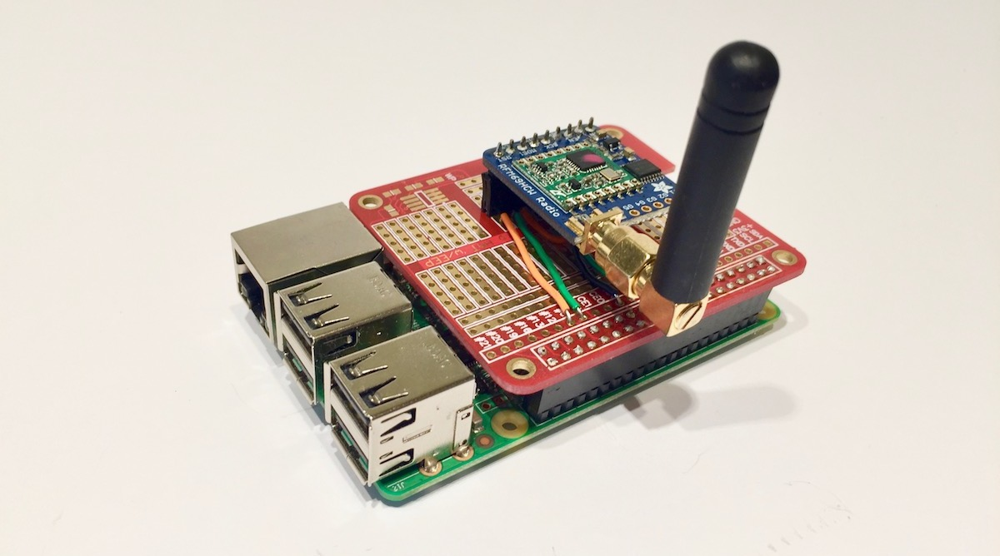

# Sound System - Server
This repository is part of a larger project which brings together Raspberry PI's, SDStore, Arduino style microcontrollers, Smart phones, BLE and RFM69 radios, to create a sound level monitoring local area sensor network. In this repository you will find code to initialise and run a local Raspberry Pi based, SD-Store server. For more information see http://kittley.com.



## Setup 
Weather you are want to run this project locally or deploy to a Raspberry Pi there are a few steps we need to complete.

1. Create a python 3 environment on your local machine using your favourite virtual environment manager e.g. using Anaconda, and activate it: 

```
conda create --name soundman

source activate soundman
```

3. Clone this repository and open the folder.
```
cd /path/to/save/location/

git clone https://github.com/jkittley/soundsystem-server.git 

cd soundsystem-server
```

4. Install the required Python packages:

```
pip install -r requirements.txt
```

## Run locally
If you want to run the project locally then you need to tell Django that the project is on a local machine. You can do this by creating a environmental variable before you run the server:

```
export LOCAL=1 & python manage.py runserver
```

## Deploy to a remote Raspberry Pi

1. The first command will turn your Raspberry Pi into a webserver.
```
fab install_webserver -H raspberrypi.local
``` 
2. Now we need to upload the Soundman website for the first time.
```
fab setup_website -H raspberrypi.local
``` 
3. Next we need to create a Amin user so we can login and make changes.
```
fab create_superuser -H raspberrypi.local
```

## Deploy changes to remote Raspberry Pi
If you make changes to the code and want to redeloy them to the Raspberry pi you can use the following command. It will copy accross the source files and reboot all the nessesary services automatically.
```
fab redeploy -H raspberrypi.local
```
